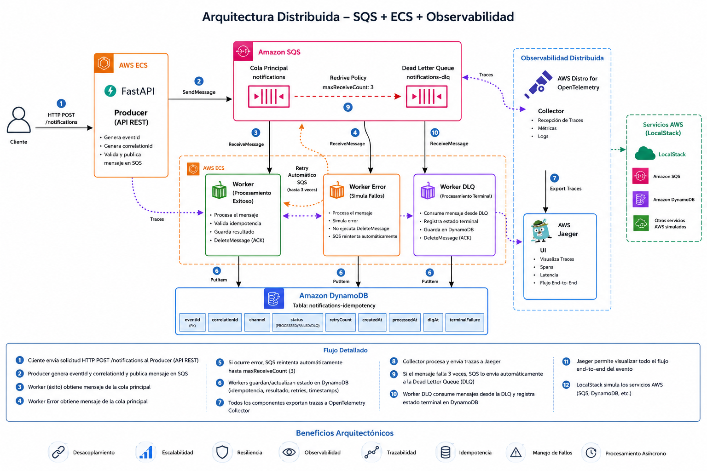

# Laboratorio Arquitectura Distribuida SQS + ECS + Observabilidad

## Arquitectura



## Descripción

Laboratorio distribuido basado en:
- Amazon SQS
- FastAPI
- Workers
- OpenTelemetry
- Jaeger
- DynamoDB
- DLQ

## Requerimientos

- macOS, Linux o Windows WSL2
- Docker Desktop o Colima
- Docker Compose
- Python 3.11+
- curl

## Instalación Colima

```bash
brew install colima docker docker-compose
colima start
docker ps
```

## Puertos

| Puerto | Servicio |
|---|---|
| 16686 | Jaeger |
| 4566 | LocalStack |
| 8000 | DynamoDB |
| 8001 | FastAPI |
| 4317 | OpenTelemetry |

## Flujo

```text
Cliente REST
↓
FastAPI Producer
↓
Amazon SQS
↓
Worker / Worker Error
↓
Retries
↓
Dead Letter Queue
↓
Worker DLQ
↓
DynamoDB
↓
Jaeger
```

## Levantar Ambiente

```bash
docker compose up --build
bash init-sqs.sh
```

## Flujo Exitoso

```bash
curl -X POST http://localhost:8001/notifications \
-H "Content-Type: application/json" \
-d '{
  "channel": "EMAIL",
  "recipient": "test@test.com",
  "message": "Hola desde FastAPI"
}'
```

## Flujo Error + DLQ

```bash
curl -X POST http://localhost:8001/notifications \
-H "Content-Type: application/json" \
-d '{
  "channel": "ERROR",
  "recipient": "test@test.com",
  "message": "Hola error"
}'
```

## Consultar DynamoDB

```bash
docker run --rm --network lab_notificaciones_default \
-e AWS_ACCESS_KEY_ID=test \
-e AWS_SECRET_ACCESS_KEY=test \
-e AWS_DEFAULT_REGION=us-east-1 \
amazon/aws-cli \
dynamodb scan \
--table-name notifications-idempotency \
--endpoint-url http://dynamodb-local:8000
```

## Estados

### PROCESSED

```json
{
  "status": "PROCESSED"
}
```

### DLQ

```json
{
  "status": "DLQ",
  "retryCount": 3,
  "terminalFailure": true
}
```
